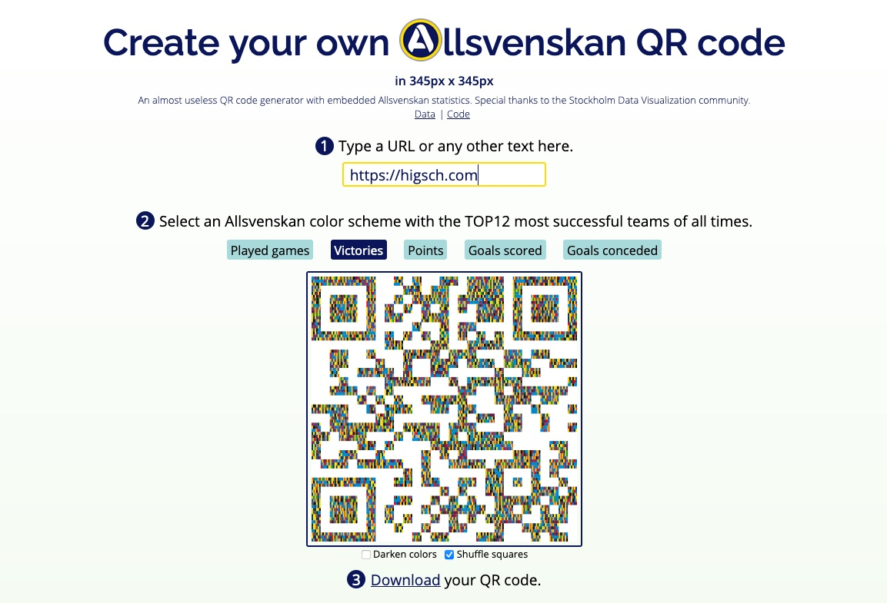

# Allsvenskans QR Code generator



## Run the viz locally

Install [npm](https://www.npmjs.com/get-npm).

```
git clone https://github.com/higsch/sthlm-challenge-allsvenskan.git
cd sthlm-challenge-allsvenskan

npm install

npm run dev
```

Open your browser at `localhost:5000`.


## Created with

HTML, CSS, JavaScript, Svelte, D3, qrcode

With [data](https://github.com/Dataviz-Stockholm/challenges/blob/main/Challenge_two-Beautiful-game/Allsvenskan%20-%20All%20time%20stats.csv) from the Data Visualization Stockholm meetup community.


## Created by

Matthias Stahl ([higsch | data & design](https://www.higsch.com)), 2021
